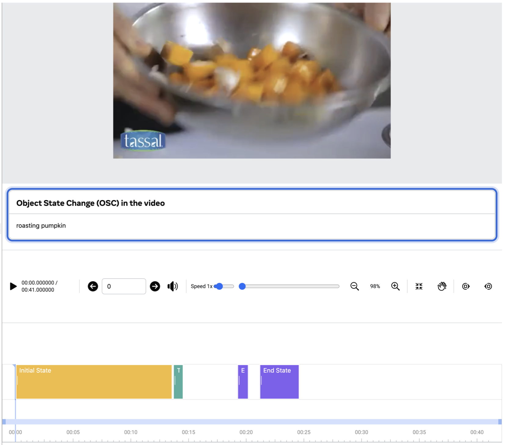

# What this pipeline does

A conceptual overview of the VIDOSC-pipeline project: the research problem it
addresses, what upstream VidOSC contributes, and what this repo adds on top.

For setup and command-line usage, see [INSTRUCTIONS.md](INSTRUCTIONS.md). This
document is the *why*; that one is the *how*.

---

## Contents

1. [The problem: object state changes](#the-problem-object-state-changes)
2. [What VidOSC is](#what-vidosc-is)
3. [What this repo adds](#what-this-repo-adds)
4. [A worked example](#a-worked-example)
5. [What the output is good for](#what-the-output-is-good-for)
6. [Known limitations](#known-limitations)

---

## The problem: object state changes

An **object state change** (OSC) is a transformation an object undergoes over
time: an apple *browning*, pumpkin *roasting*, dough *rolling*. Unlike action
recognition — which asks *what is the person doing?* — OSC modeling asks *what
is happening to the object, and how far along is it?*

The task is to label every second of a video with one of four states:

| Label | State | Meaning |
|:-:|---|---|
| `0` | `background` | No part of the state change is visible |
| `1` | `initial_state` | The object before the transformation |
| `2` | `transitioning` | The change is actively in progress |
| `3` | `end_state` | The object after the transformation |

These states are **temporally ordered**. An apple cannot be browned before it is
sliced, and it does not un-brown. Enforcing that ordering is a core part of how
the model works — it isn't free-form per-frame classification.

Here is what a human-annotated ground truth looks like, for a `roasting_pumpkin`
clip:



Two things worth noticing in that timeline:

- **States occupy contiguous spans, not isolated frames.** The initial state runs
  roughly 0–13s, transitioning is a brief band around 13–15s, and the end state
  appears later. The transition is often the *shortest* of the three, which makes
  it the hardest to localize.
- **A state can appear in more than one span**, and the gaps between spans are
  `background` — moments where the camera cuts away, the object is off-screen, or
  what's visible doesn't clearly belong to any stage.

---

## What VidOSC is

[**Learning Object State Changes in Videos: An Open-World Perspective**](https://arxiv.org/abs/2312.11782)
Zihui Xue, Kumar Ashutosh, Kristen Grauman — CVPR 2024
[project page](https://vision.cs.utexas.edu/projects/VidOSC/) ·
[code](https://github.com/facebookresearch/VidOSC)

VidOSC is the model and dataset released with that paper. Its central claim is
about the **open world**: prior OSC work trained one model per state change from
a small fixed vocabulary, so it could never handle a transformation it hadn't
seen. VidOSC learns representations that generalize to *novel* OSCs — object and
transformation combinations absent from training.

### The dataset: HowToChange

- **Evaluation:** 5,423 human-annotated video clips from HowTo100M, covering
  **409 OSCs** — 20 state transitions across 134 objects.
- **Training:** 36,075 clips mined automatically, with no manual labels. Candidate
  clips are found via ASR transcripts and LLAMA2, then pseudo-labeled with
  CLIP/VideoCLIP.

Seen/novel splits live in the upstream `data_files/osc_split.csv`, which is what
makes the open-world evaluation possible.

### The model

Small and deliberately so. Per-second visual features are fed to a transformer
(`FeatTimeTransformer` — 3 layers, 4 heads, width 512) that classifies each
second into the four states. Two design details matter:

- **It sees the whole clip at once.** The prediction at second *t* depends on
  every other second, not just frame *t*. This is what lets it infer "this must
  be the end state, because the transition already happened."
- **Ordering is enforced at decode time**, not learned implicitly. Upstream uses
  a CUDA kernel (`lookforthechange`) for this; the patches in this repo add a
  pure-PyTorch dynamic program that does the same job for an arbitrary number of
  states. See [patches/README.md](patches/README.md).

The heavy lifting is in the *features*, not the classifier. VidOSC uses
InternVideo-MM-L14 embeddings, optionally concatenated with object-centric
features from a hand–object detector — which is why the released checkpoints
expect 1536-dim input rather than 768.

---

## What this repo adds

Upstream VidOSC is research code: it assumes Linux with CUDA, and it evaluates
over a CSV-driven dataset. Four additions make it usable as a pipeline.

### 1. It runs on Apple Silicon

Upstream cannot even be imported on macOS — `task.py` imports a compiled CUDA
extension at module scope, and the pinned conda environment is Linux-only down to
the build strings. The [patches/](patches/) directory fixes both, so a MacBook is
a working dev environment instead of requiring a remote GPU box.

### 2. Inference on a single video, without the dataset

Upstream runs evaluation over annotated CSV splits.
[run_inference.py](run_inference.py) takes one feature file and one checkpoint
and prints a timeline — no annotations, no dataset plumbing. It reads the model
architecture straight off the checkpoint weights, so there are no config flags to
get wrong.

### 3. Feature extraction from arbitrary video

[extract_features.py](extract_features.py) decodes any `.mp4` at 1 fps and
encodes each frame with CLIP ViT-L/14, so you can point the pipeline at your own
footage rather than only the pre-extracted HowToChange features. (This is an
approximation — see [limitations](#known-limitations).)

### 4. Descriptions, not just labels

This is the substantive addition. VidOSC tells you **when** a state change
happens; it does not tell you **what the object looks like**. Its entire output
vocabulary is four integers.

[describe_states.py](describe_states.py) closes that gap. It runs inference,
groups consecutive seconds sharing a state into segments, and sends one
representative frame per segment to a vision-language model with an
object-specific prompt. The result is a timeline annotated in natural language:
not just "seconds 23–39 are `transitioning`", but "sliced, pale, enzymatically
browning at edges."

---

## A worked example

Running `describe_states.py` on a `browning_apple` clip with the Claude backend,
logged to Weights & Biases:

```bash
python describe_states.py \
    --video data/eval_clips/browning_apple/pof9jFBhHVA_st13.0_dur40.0.mp4 \
    --feat  data/feats/pof9jFBhHVA_browning_apple_real.pth.tar \
    --ckpt  checkpoints/browning.ckpt \
    --vlm_backend claude
```


Reading the table:

| Segment | State | Description |
|---|---|---|
| t=0–9s | `initial_state` | Shiny, deep red, firm, and whole. |
| t=12–20s | `initial_state` | Whole, firm, glossy red apples; sliced half showing pale, crisp flesh. |
| t=21s | `transitioning` | Oxidized, browning flesh; firm texture preserved. |
| t=23–39s | `transitioning` | Sliced, pale, enzymatically browning at edges. |

The captions track the physical process in the right order — whole and glossy,
then cut open with pale flesh exposed, then oxidizing at the edges. Neither
component could produce this alone: VidOSC supplies the segmentation, the VLM
supplies the description, and the object name (`apple`) is derived from the clip's
parent directory so the prompt asks about the right thing.

**Why the gaps?** Seconds 10–11 and 22 are missing because they were predicted
`background`, and `--skip_states` defaults to `background` — captioning frames
where nothing relevant is visible wastes API calls. Pass `--skip_states ''` to
caption every segment.

**Why two `initial_state` rows?** Segments break on any state change, so a
background stretch between two initial-state spans splits them into separate
rows. The segment boundaries reflect the raw prediction sequence, without
smoothing.

Each row logs the actual frame sent to the VLM, so you can check whether a poor
caption came from a bad frame choice or a bad model response. `run_inference.py`
logs a complementary view: per-second predictions with confidences, a
state-duration bar chart, and a color-coded timeline image.

---

## What the output is good for

- **Structured recipe understanding.** Converting cooking video into a sequence
  of "the object looked like *X* at time *T*" statements — the motivating use
  case for the ChefOST project this feeds into.
- **Grounding a language model in visual evidence.** The captions are anchored to
  specific frames at specific times, rather than a summary of the whole video.
- **Inspecting model behavior.** Reading captions at predicted boundaries is a
  fast way to tell whether a transition was localized correctly, without opening
  the video and scrubbing.
- **Building comparison sets.** Because every run logs to W&B with its config,
  runs across checkpoints, backends, and sampling rates stay comparable.

---

## Known limitations

Be aware of these before trusting any numbers out of this pipeline.

**Feature mismatch.** [extract_features.py](extract_features.py) produces CLIP
ViT-L/14 features, but the checkpoints were trained on InternVideo-MM-L14. Same
architecture family and output dimension, different model — results are
approximate.

**Missing object-centric half.** All three released checkpoints expect 1536-dim
input: whole-frame features concatenated with hand–object detector features.
`extract_features.py` produces only the first 768 dims, and the rest gets
zero-padded with a warning. Stacked on the point above, features you extract
yourself are off on two axes at once. Use the pre-extracted `feats_handobj`
files with `--obj_feat` for faithful results.

**No temporal smoothing in this repo's output.** Single-second segments (like
`t=21s` above) survive into the caption table as their own rows. VidOSC's
ordering constraint applies during decoding, but nothing merges brief spurious
runs afterward.

**The VLM sees one frame per segment.** The middle frame stands in for the whole
span. For a long segment where the object changes appreciably, that single frame
may not be representative — `--sample_rate per_second` trades cost for
resolution.

**Captions are not verified.** The VLM describes what it sees in a frame it is
*told* belongs to a given state. It will not push back if the state label is
wrong, so a misclassified segment produces a confident, wrong-but-plausible
description.

---

## Further reading

- [INSTRUCTIONS.md](INSTRUCTIONS.md) — installation, commands, flags, troubleshooting
- [patches/README.md](patches/README.md) — what's modified in upstream and why
- [VidOSC paper](https://arxiv.org/abs/2312.11782) · [project page](https://vision.cs.utexas.edu/projects/VidOSC/)

### Citation

```bibtex
@inproceedings{xue2024learning,
  title     = {Learning Object State Changes in Videos: An Open-World Perspective},
  author    = {Xue, Zihui and Ashutosh, Kumar and Grauman, Kristen},
  booktitle = {CVPR},
  year      = {2024}
}
```
